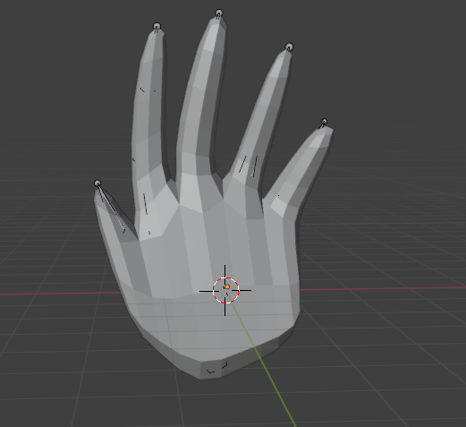
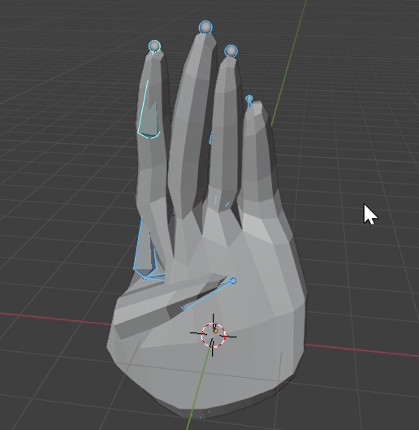

## 🚀 Features

- Play animation in Blender when the **'B'** key is pressed.
- Integration with **Jupyter Notebook** for animation control.
- Clean and modular Python code using `bpy` (Blender Python API).

## 🛠️ Requirements

- [Blender](https://www.blender.org/) (tested with version 3.x)
- Python environment with `bpy` (if used externally)
- Jupyter Notebook (for running `main.ipynb`)

> **Note:** Blender scripts must run inside Blender's scripting environment, unless you've configured external execution with `bpy`.

## 🧪 How to Use

### Run Inside Blender:
1. Open `animated_hand.blend` in Blender.
2. In the Scripting tab, load and run `animate_script.py`.
3. Press **'B'** in the 3D Viewport to start the animation.

### Run from Notebook:
1. Open `main.ipynb`.
2. Follow the instructions inside the notebook to trigger animation.

## 📸 Preview

Here are some previews of the  hand:

### 📷 Static Preview

## 📄 License
See the [LICENSE](./LICENSE) file for full details.
---

Created with ❤️ by Ghada Malak GUERGOUR .
